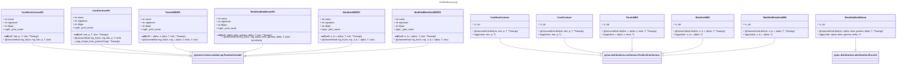

```mermaid
---
title: clv/distributions.py
---
classDiagram
    class ContNonContractRV {
        + str name
        + str signature
        + str dtype
        + tuple _print_name
        - __call__(self, lam, p, T, size, **kwargs)
        + @classmethod rng_fn(cls, rng, lam, p, T, size)
    }

    class ContNonContract {
        + rv_op
        + @classmethod dist(cls, lam, p, T, **kwargs)
        + logp(value, lam, p, T)
    }

    class ContContractRV {
        + str name
        + str signature
        + str dtype
        + tuple _print_name
        - __call__(self, lam, p, T, size, **kwargs)
        + @classmethod rng_fn(cls, rng, lam, p, T, size)
        - _supp_shape_from_params(*args, **kwargs)
    }

    class ContContract {
        + rv_op
        + @classmethod dist(cls, lam, p, T, **kwargs)
        + logp(value, lam, p, T)
    }

    class ParetoNBDRV {
        + str name
        + str signature
        + str dtype
        + tuple _print_name
        - __call__(self, r, alpha, s, beta, T, size, **kwargs)
        + @classmethod rng_fn(cls, rng, r, alpha, s, beta, T, size)
    }

    class ParetoNBD {
        + rv_op
        + @classmethod dist(cls, r, alpha, s, beta, T, **kwargs)
        + logp(value, r, alpha, s, beta, T)
    }

    class BetaGeoBetaBinomRV {
        + str name
        + str signature
        + str dtype
        + tuple _print_name
        - __call__(self, alpha, beta, gamma, delta, T, size, **kwargs)
        + @classmethod rng_fn(cls, rng, alpha, beta, gamma, delta, T, size) np.ndarray
    }

    class BetaGeoBetaBinom {
        + rv_op
        + @classmethod dist(cls, alpha, beta, gamma, delta, T, **kwargs)
        + logp(value, alpha, beta, gamma, delta, T)
    }

    class BetaGeoNBDRV {
        + str name
        + str signature
        + str dtype
        + tuple _print_name
        - __call__(self, a, b, r, alpha, T, size, **kwargs)
        + @classmethod rng_fn(cls, rng, a, b, r, alpha, T, size)
    }

    class BetaGeoNBD {
        + rv_op
        + @classmethod dist(cls, a, b, r, alpha, T, **kwargs)
        + logp(value, a, b, r, alpha, T)
    }

    class ModifiedBetaGeoNBDRV {
        + str name
        + str signature
        + str dtype
        + tuple _print_name
        - __call__(self, a, b, r, alpha, T, size, **kwargs)
        + @classmethod rng_fn(cls, rng, a, b, r, alpha, T, size)
    }

    class ModifiedBetaGeoNBD {
        + rv_op
        + @classmethod dist(cls, a, b, r, alpha, T, **kwargs)
        + logp(value, a, b, r, alpha, T)
    }

    ContNonContractRV --|> `pytensor.tensor.random.op.RandomVariable`

    ContNonContract --|> `pymc.distributions.continuous.PositiveContinuous`

    ContContractRV --|> `pytensor.tensor.random.op.RandomVariable`

    ContContract --|> `pymc.distributions.continuous.PositiveContinuous`

    ParetoNBDRV --|> `pytensor.tensor.random.op.RandomVariable`

    ParetoNBD --|> `pymc.distributions.continuous.PositiveContinuous`

    BetaGeoBetaBinomRV --|> `pytensor.tensor.random.op.RandomVariable`

    BetaGeoBetaBinom --|> `pymc.distributions.distribution.Discrete`

    BetaGeoNBDRV --|> `pytensor.tensor.random.op.RandomVariable`

    BetaGeoNBD --|> `pymc.distributions.continuous.PositiveContinuous`

    ModifiedBetaGeoNBDRV --|> `pytensor.tensor.random.op.RandomVariable`

    ModifiedBetaGeoNBD --|> `pymc.distributions.continuous.PositiveContinuous`
```
