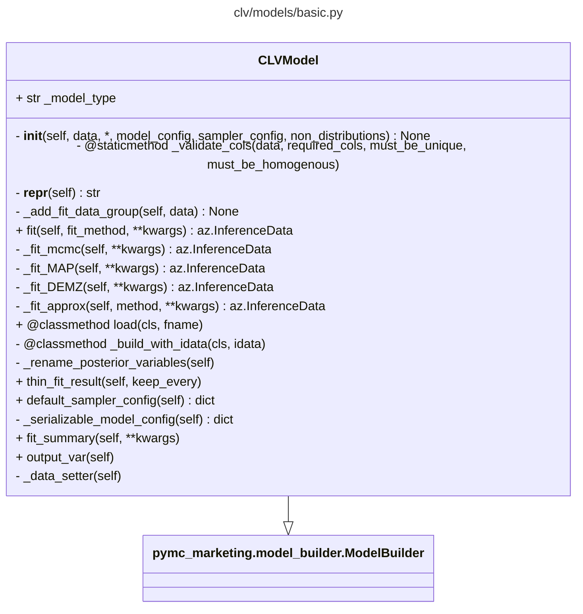

```mermaid
---
title: clv/models/basic.py
---
classDiagram
    class CLVModel {
        + str _model_type
        - __init__(self, data, *, model_config, sampler_config, non_distributions) None
        - @staticmethod _validate_cols(data, required_cols, must_be_unique, must_be_homogenous)
        - __repr__(self) str
        - _add_fit_data_group(self, data) None
        + fit(self, fit_method, **kwargs) az.InferenceData
        - _fit_mcmc(self, **kwargs) az.InferenceData
        - _fit_MAP(self, **kwargs) az.InferenceData
        - _fit_DEMZ(self, **kwargs) az.InferenceData
        - _fit_approx(self, method, **kwargs) az.InferenceData
        + @classmethod load(cls, fname)
        - @classmethod _build_with_idata(cls, idata)
        - _rename_posterior_variables(self)
        + thin_fit_result(self, keep_every)
        + default_sampler_config(self) dict
        - _serializable_model_config(self) dict
        + fit_summary(self, **kwargs)
        + output_var(self)
        - _data_setter(self)
    }

    CLVModel --|> `pymc_marketing.model_builder.ModelBuilder`
```
