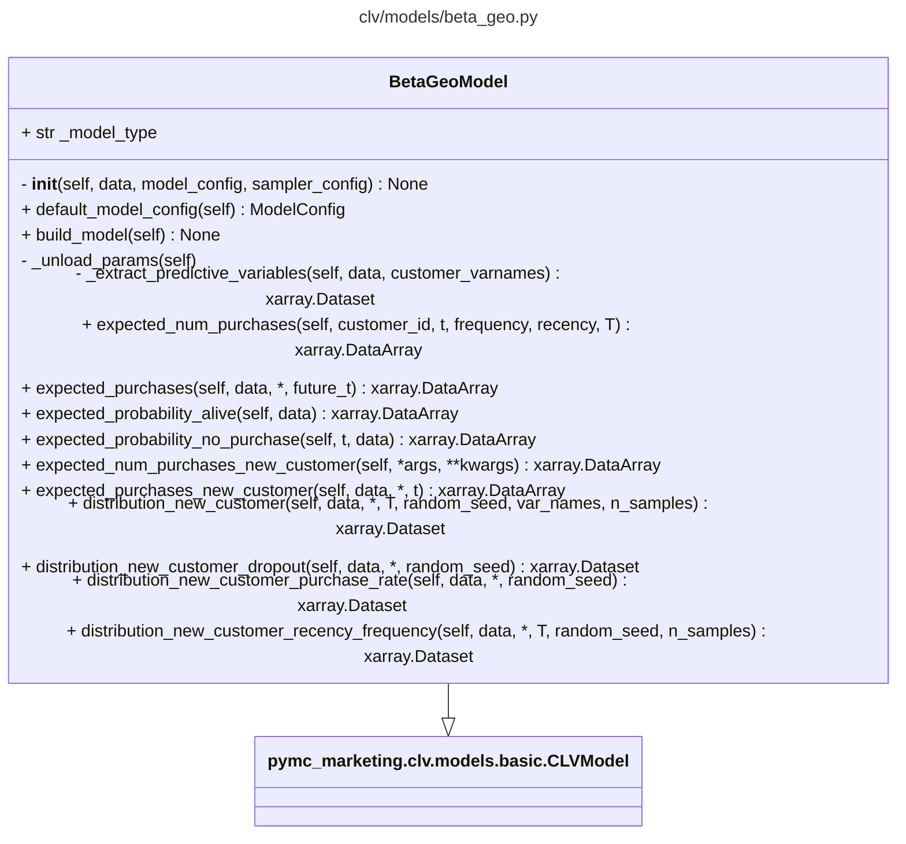

```mermaid
---
title: clv/models/beta_geo.py
---
classDiagram
    class BetaGeoModel {
        + str _model_type
        - __init__(self, data, model_config, sampler_config) None
        + default_model_config(self) ModelConfig
        + build_model(self) None
        - _unload_params(self)
        - _extract_predictive_variables(self, data, customer_varnames) xarray.Dataset
        + expected_num_purchases(self, customer_id, t, frequency, recency, T) xarray.DataArray
        + expected_purchases(self, data, *, future_t) xarray.DataArray
        + expected_probability_alive(self, data) xarray.DataArray
        + expected_probability_no_purchase(self, t, data) xarray.DataArray
        + expected_num_purchases_new_customer(self, *args, **kwargs) xarray.DataArray
        + expected_purchases_new_customer(self, data, *, t) xarray.DataArray
        + distribution_new_customer(self, data, *, T, random_seed, var_names, n_samples) xarray.Dataset
        + distribution_new_customer_dropout(self, data, *, random_seed) xarray.Dataset
        + distribution_new_customer_purchase_rate(self, data, *, random_seed) xarray.Dataset
        + distribution_new_customer_recency_frequency(self, data, *, T, random_seed, n_samples) xarray.Dataset
    }

    BetaGeoModel --|> `pymc_marketing.clv.models.basic.CLVModel`
```
