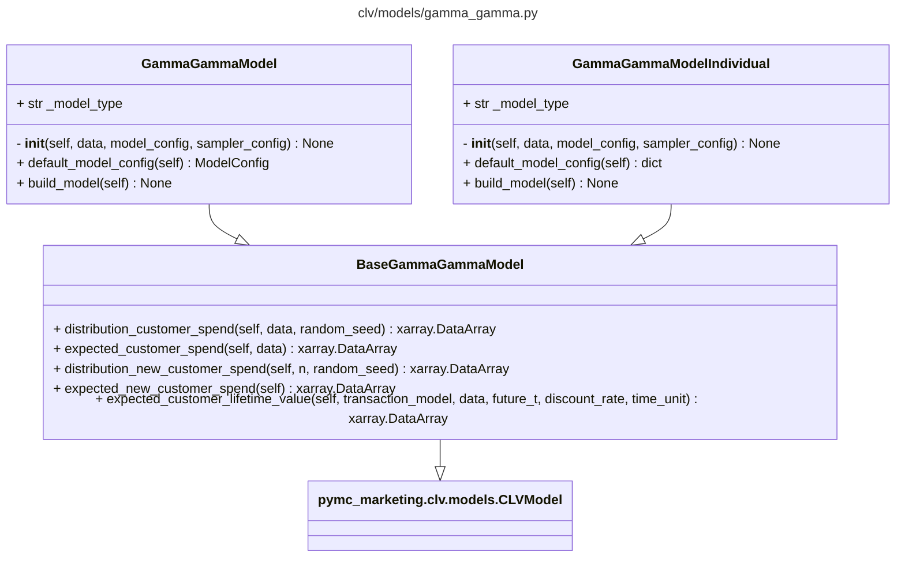

```mermaid
---
title: clv/models/gamma_gamma.py
---
classDiagram
    class BaseGammaGammaModel {
        + distribution_customer_spend(self, data, random_seed) xarray.DataArray
        + expected_customer_spend(self, data) xarray.DataArray
        + distribution_new_customer_spend(self, n, random_seed) xarray.DataArray
        + expected_new_customer_spend(self) xarray.DataArray
        + expected_customer_lifetime_value(self, transaction_model, data, future_t, discount_rate, time_unit) xarray.DataArray
    }

    class GammaGammaModel {
        + str _model_type
        - __init__(self, data, model_config, sampler_config) None
        + default_model_config(self) ModelConfig
        + build_model(self) None
    }

    class GammaGammaModelIndividual {
        + str _model_type
        - __init__(self, data, model_config, sampler_config) None
        + default_model_config(self) dict
        + build_model(self) None
    }

    BaseGammaGammaModel --|> `pymc_marketing.clv.models.CLVModel`

    GammaGammaModel --|> BaseGammaGammaModel

    GammaGammaModelIndividual --|> BaseGammaGammaModel
```
