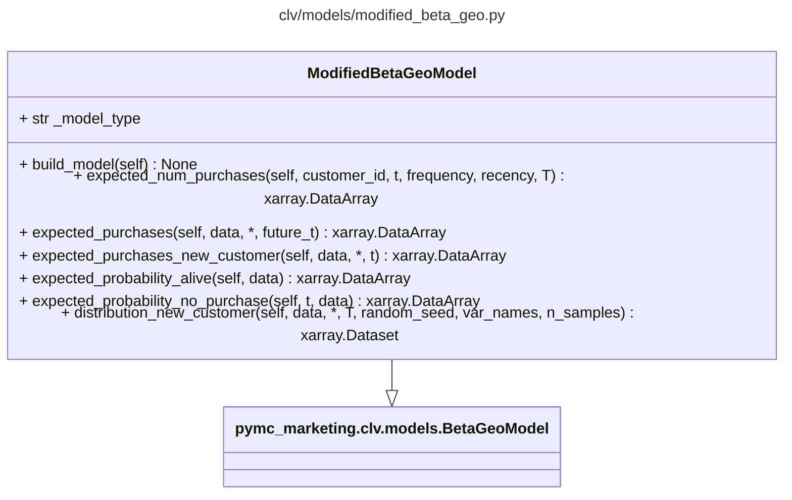

```mermaid
---
title: clv/models/modified_beta_geo.py
---
classDiagram
    class ModifiedBetaGeoModel {
        + str _model_type
        + build_model(self) None
        + expected_num_purchases(self, customer_id, t, frequency, recency, T) xarray.DataArray
        + expected_purchases(self, data, *, future_t) xarray.DataArray
        + expected_purchases_new_customer(self, data, *, t) xarray.DataArray
        + expected_probability_alive(self, data) xarray.DataArray
        + expected_probability_no_purchase(self, t, data) xarray.DataArray
        + distribution_new_customer(self, data, *, T, random_seed, var_names, n_samples) xarray.Dataset
    }

    ModifiedBetaGeoModel --|> `pymc_marketing.clv.models.BetaGeoModel`
```
