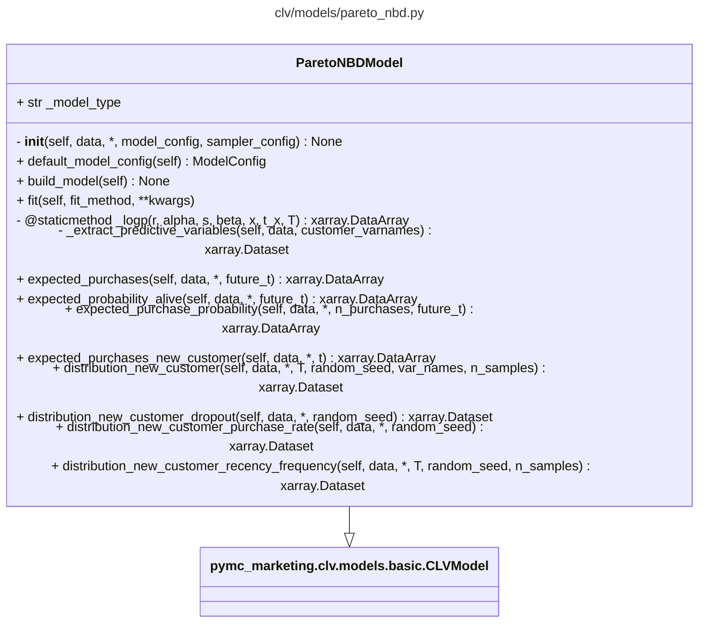

```mermaid
---
title: clv/models/pareto_nbd.py
---
classDiagram
    class ParetoNBDModel {
        + str _model_type
        - __init__(self, data, *, model_config, sampler_config) None
        + default_model_config(self) ModelConfig
        + build_model(self) None
        + fit(self, fit_method, **kwargs)
        - @staticmethod _logp(r, alpha, s, beta, x, t_x, T) xarray.DataArray
        - _extract_predictive_variables(self, data, customer_varnames) xarray.Dataset
        + expected_purchases(self, data, *, future_t) xarray.DataArray
        + expected_probability_alive(self, data, *, future_t) xarray.DataArray
        + expected_purchase_probability(self, data, *, n_purchases, future_t) xarray.DataArray
        + expected_purchases_new_customer(self, data, *, t) xarray.DataArray
        + distribution_new_customer(self, data, *, T, random_seed, var_names, n_samples) xarray.Dataset
        + distribution_new_customer_dropout(self, data, *, random_seed) xarray.Dataset
        + distribution_new_customer_purchase_rate(self, data, *, random_seed) xarray.Dataset
        + distribution_new_customer_recency_frequency(self, data, *, T, random_seed, n_samples) xarray.Dataset
    }

    ParetoNBDModel --|> `pymc_marketing.clv.models.basic.CLVModel`
```
