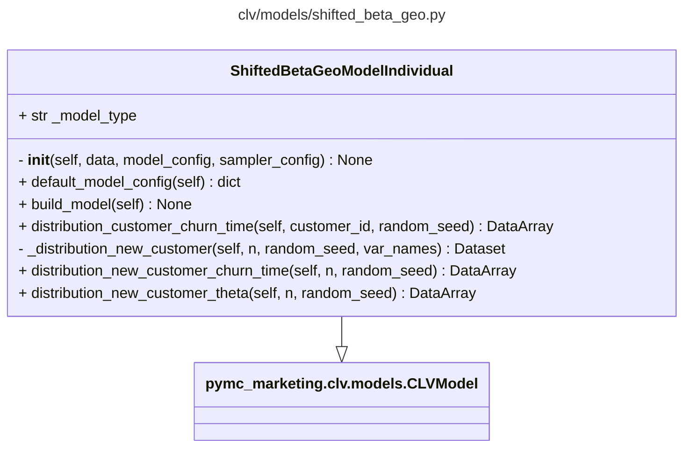

```mermaid
---
title: clv/models/shifted_beta_geo.py
---
classDiagram
    class ShiftedBetaGeoModelIndividual {
        + str _model_type
        - __init__(self, data, model_config, sampler_config) None
        + default_model_config(self) dict
        + build_model(self) None
        + distribution_customer_churn_time(self, customer_id, random_seed) DataArray
        - _distribution_new_customer(self, n, random_seed, var_names) Dataset
        + distribution_new_customer_churn_time(self, n, random_seed) DataArray
        + distribution_new_customer_theta(self, n, random_seed) DataArray
    }

    ShiftedBetaGeoModelIndividual --|> `pymc_marketing.clv.models.CLVModel`
```
