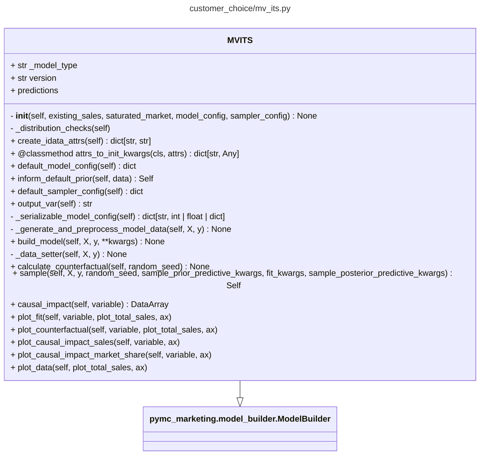

```mermaid
---
title: customer_choice/mv_its.py
---
classDiagram
    class MVITS {
        + str _model_type
        + str version
        - __init__(self, existing_sales, saturated_market, model_config, sampler_config) None
        - _distribution_checks(self)
        + create_idata_attrs(self) dict[str, str]
        + @classmethod attrs_to_init_kwargs(cls, attrs) dict[str, Any]
        + default_model_config(self) dict
        + inform_default_prior(self, data) Self
        + default_sampler_config(self) dict
        + output_var(self) str
        - _serializable_model_config(self) dict[str, int | float | dict]
        - _generate_and_preprocess_model_data(self, X, y) None
        + build_model(self, X, y, **kwargs) None
        - _data_setter(self, X, y) None
        + calculate_counterfactual(self, random_seed) None
        + sample(self, X, y, random_seed, sample_prior_predictive_kwargs, fit_kwargs, sample_posterior_predictive_kwargs) Self
        + causal_impact(self, variable) DataArray
        + plot_fit(self, variable, plot_total_sales, ax)
        + plot_counterfactual(self, variable, plot_total_sales, ax)
        + plot_causal_impact_sales(self, variable, ax)
        + plot_causal_impact_market_share(self, variable, ax)
        + plot_data(self, plot_total_sales, ax)
        + predictions
    }

    MVITS --|> `pymc_marketing.model_builder.ModelBuilder`
```
