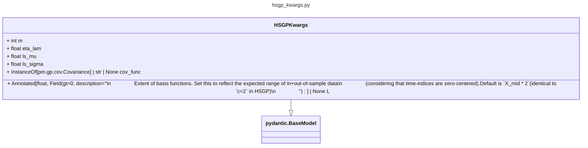

```mermaid
---
title: hsgp_kwargs.py
---
classDiagram
    class HSGPKwargs {
        + int m
        + Annotated[float, Field(gt=0, description="\n                Extent of basis functions. Set this to reflect the expected range of in+out-of-sample data\n                (considering that time-indices are zero-centered).Default is `X_mid * 2` (identical to `c=2` in HSGP)\n                ")] | None L
        + float eta_lam
        + float ls_mu
        + float ls_sigma
        + InstanceOf[pm.gp.cov.Covariance] | str | None cov_func
    }

    HSGPKwargs --|> `pydantic.BaseModel`
```
