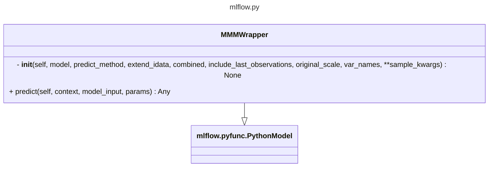

```mermaid
---
title: mlflow.py
---
classDiagram
    class MMMWrapper {
        - __init__(self, model, predict_method, extend_idata, combined, include_last_observations, original_scale, var_names, **sample_kwargs) None
        + predict(self, context, model_input, params) Any
    }

    MMMWrapper --|> `mlflow.pyfunc.PythonModel`
```
