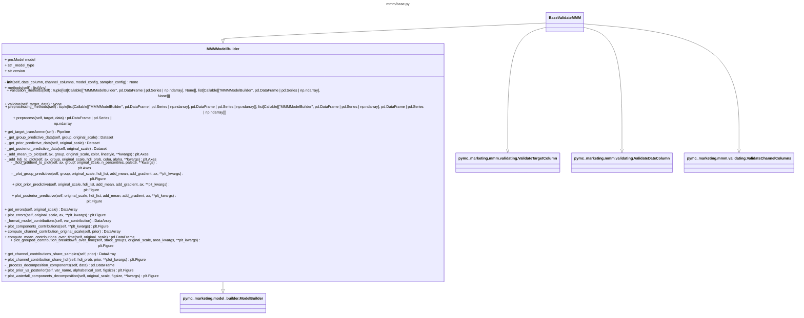

```mermaid
---
title: mmm/base.py
---
classDiagram
    class MMMModelBuilder {
        + pm.Model model
        + str _model_type
        + str version
        - __init__(self, date_column, channel_columns, model_config, sampler_config) None
        + methods(self) list[Any]
        + validation_methods(self) tuple[list[Callable[["MMMModelBuilder", pd.DataFrame | pd.Series | np.ndarray], None]], list[Callable[["MMMModelBuilder", pd.DataFrame | pd.Series | np.ndarray], None]]]
        + validate(self, target, data) None
        + preprocessing_methods(self) tuple[list[Callable[["MMMModelBuilder", pd.DataFrame | pd.Series | np.ndarray], pd.DataFrame | pd.Series | np.ndarray]], list[Callable[["MMMModelBuilder", pd.DataFrame | pd.Series | np.ndarray], pd.DataFrame | pd.Series | np.ndarray]]]
        + preprocess(self, target, data) pd.DataFrame | pd.Series | np.ndarray
        + get_target_transformer(self) Pipeline
        - _get_group_predictive_data(self, group, original_scale) Dataset
        - _get_prior_predictive_data(self, original_scale) Dataset
        - _get_posterior_predictive_data(self, original_scale) Dataset
        - _add_mean_to_plot(self, ax, group, original_scale, color, linestyle, **kwargs) plt.Axes
        - _add_hdi_to_plot(self, ax, group, original_scale, hdi_prob, color, alpha, **kwargs) plt.Axes
        - _add_gradient_to_plot(self, ax, group, original_scale, n_percentiles, palette, **kwargs) plt.Axes
        - _plot_group_predictive(self, group, original_scale, hdi_list, add_mean, add_gradient, ax, **plt_kwargs) plt.Figure
        + plot_prior_predictive(self, original_scale, hdi_list, add_mean, add_gradient, ax, **plt_kwargs) plt.Figure
        + plot_posterior_predictive(self, original_scale, hdi_list, add_mean, add_gradient, ax, **plt_kwargs) plt.Figure
        + get_errors(self, original_scale) DataArray
        + plot_errors(self, original_scale, ax, **plt_kwargs) plt.Figure
        - _format_model_contributions(self, var_contribution) DataArray
        + plot_components_contributions(self, **plt_kwargs) plt.Figure
        + compute_channel_contribution_original_scale(self, prior) DataArray
        + compute_mean_contributions_over_time(self, original_scale) pd.DataFrame
        + plot_grouped_contribution_breakdown_over_time(self, stack_groups, original_scale, area_kwargs, **plt_kwargs) plt.Figure
        + get_channel_contributions_share_samples(self, prior) DataArray
        + plot_channel_contribution_share_hdi(self, hdi_prob, prior, **plot_kwargs) plt.Figure
        - _process_decomposition_components(self, data) pd.DataFrame
        + plot_prior_vs_posterior(self, var_name, alphabetical_sort, figsize) plt.Figure
        + plot_waterfall_components_decomposition(self, original_scale, figsize, **kwargs) plt.Figure
    }

    class BaseValidateMMM

    MMMModelBuilder --|> `pymc_marketing.model_builder.ModelBuilder`

    BaseValidateMMM --|> MMMModelBuilder

    BaseValidateMMM --|> `pymc_marketing.mmm.validating.ValidateTargetColumn`

    BaseValidateMMM --|> `pymc_marketing.mmm.validating.ValidateDateColumn`

    BaseValidateMMM --|> `pymc_marketing.mmm.validating.ValidateChannelColumns`
```
