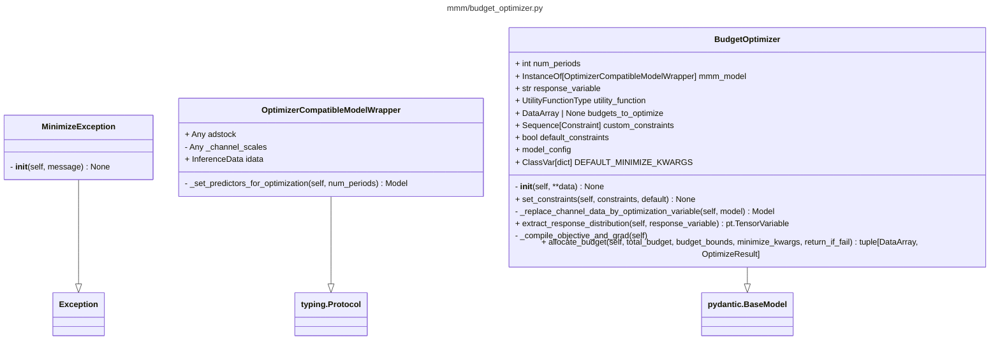

```mermaid
---
title: mmm/budget_optimizer.py
---
classDiagram
    class MinimizeException {
        - __init__(self, message) None
    }

    class OptimizerCompatibleModelWrapper {
        + Any adstock
        - Any _channel_scales
        + InferenceData idata
        - _set_predictors_for_optimization(self, num_periods) Model
    }

    class BudgetOptimizer {
        + int num_periods
        + InstanceOf[OptimizerCompatibleModelWrapper] mmm_model
        + str response_variable
        + UtilityFunctionType utility_function
        + DataArray | None budgets_to_optimize
        + Sequence[Constraint] custom_constraints
        + bool default_constraints
        + model_config
        + ClassVar[dict] DEFAULT_MINIMIZE_KWARGS
        - __init__(self, **data) None
        + set_constraints(self, constraints, default) None
        - _replace_channel_data_by_optimization_variable(self, model) Model
        + extract_response_distribution(self, response_variable) pt.TensorVariable
        - _compile_objective_and_grad(self)
        + allocate_budget(self, total_budget, budget_bounds, minimize_kwargs, return_if_fail) tuple[DataArray, OptimizeResult]
    }

    MinimizeException --|> Exception

    OptimizerCompatibleModelWrapper --|> `typing.Protocol`

    BudgetOptimizer --|> `pydantic.BaseModel`
```
