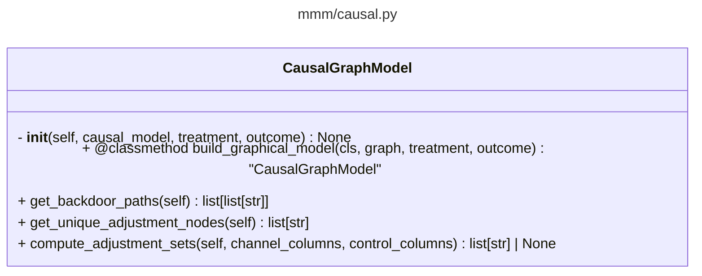

```mermaid
---
title: mmm/causal.py
---
classDiagram
    class CausalGraphModel {
        - __init__(self, causal_model, treatment, outcome) None
        + @classmethod build_graphical_model(cls, graph, treatment, outcome) "CausalGraphModel"
        + get_backdoor_paths(self) list[list[str]]
        + get_unique_adjustment_nodes(self) list[str]
        + compute_adjustment_sets(self, channel_columns, control_columns) list[str] | None
    }
```
