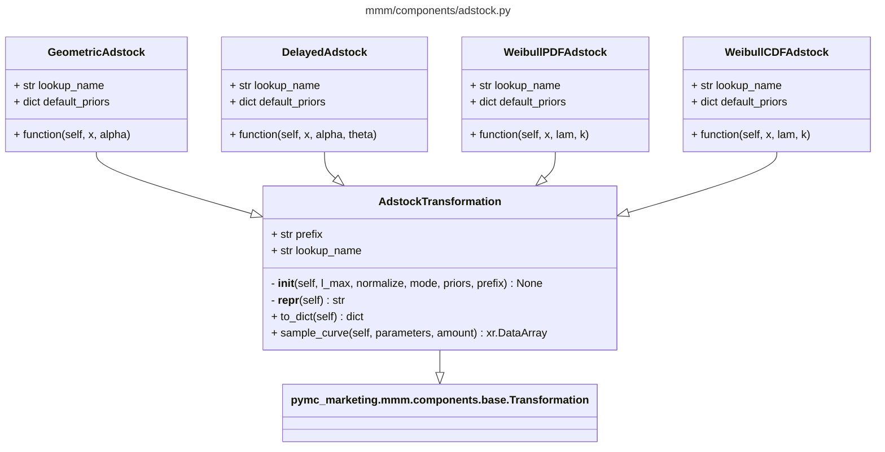

```mermaid
---
title: mmm/components/adstock.py
---
classDiagram
    class AdstockTransformation {
        + str prefix
        + str lookup_name
        - __init__(self, l_max, normalize, mode, priors, prefix) None
        - __repr__(self) str
        + to_dict(self) dict
        + sample_curve(self, parameters, amount) xr.DataArray
    }

    class GeometricAdstock {
        + str lookup_name
        + function(self, x, alpha)
        + dict default_priors
    }

    class DelayedAdstock {
        + str lookup_name
        + function(self, x, alpha, theta)
        + dict default_priors
    }

    class WeibullPDFAdstock {
        + str lookup_name
        + function(self, x, lam, k)
        + dict default_priors
    }

    class WeibullCDFAdstock {
        + str lookup_name
        + function(self, x, lam, k)
        + dict default_priors
    }

    AdstockTransformation --|> `pymc_marketing.mmm.components.base.Transformation`

    GeometricAdstock --|> AdstockTransformation

    DelayedAdstock --|> AdstockTransformation

    WeibullPDFAdstock --|> AdstockTransformation

    WeibullCDFAdstock --|> AdstockTransformation
```
