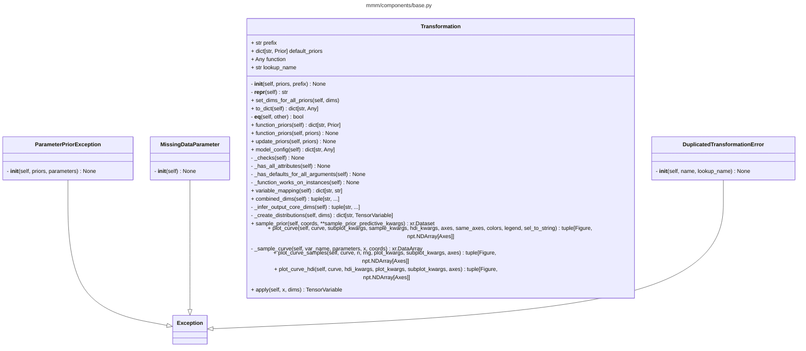

```mermaid
---
title: mmm/components/base.py
---
classDiagram
    class ParameterPriorException {
        - __init__(self, priors, parameters) None
    }

    class MissingDataParameter {
        - __init__(self) None
    }

    class Transformation {
        + str prefix
        + dict[str, Prior] default_priors
        + Any function
        + str lookup_name
        - __init__(self, priors, prefix) None
        - __repr__(self) str
        + set_dims_for_all_priors(self, dims)
        + to_dict(self) dict[str, Any]
        - __eq__(self, other) bool
        + function_priors(self) dict[str, Prior]
        + function_priors(self, priors) None
        + update_priors(self, priors) None
        + model_config(self) dict[str, Any]
        - _checks(self) None
        - _has_all_attributes(self) None
        - _has_defaults_for_all_arguments(self) None
        - _function_works_on_instances(self) None
        + variable_mapping(self) dict[str, str]
        + combined_dims(self) tuple[str, ...]
        - _infer_output_core_dims(self) tuple[str, ...]
        - _create_distributions(self, dims) dict[str, TensorVariable]
        + sample_prior(self, coords, **sample_prior_predictive_kwargs) xr.Dataset
        + plot_curve(self, curve, subplot_kwargs, sample_kwargs, hdi_kwargs, axes, same_axes, colors, legend, sel_to_string) tuple[Figure, npt.NDArray[Axes]]
        - _sample_curve(self, var_name, parameters, x, coords) xr.DataArray
        + plot_curve_samples(self, curve, n, rng, plot_kwargs, subplot_kwargs, axes) tuple[Figure, npt.NDArray[Axes]]
        + plot_curve_hdi(self, curve, hdi_kwargs, plot_kwargs, subplot_kwargs, axes) tuple[Figure, npt.NDArray[Axes]]
        + apply(self, x, dims) TensorVariable
    }

    class DuplicatedTransformationError {
        - __init__(self, name, lookup_name) None
    }

    ParameterPriorException --|> Exception

    MissingDataParameter --|> Exception

    DuplicatedTransformationError --|> Exception
```
