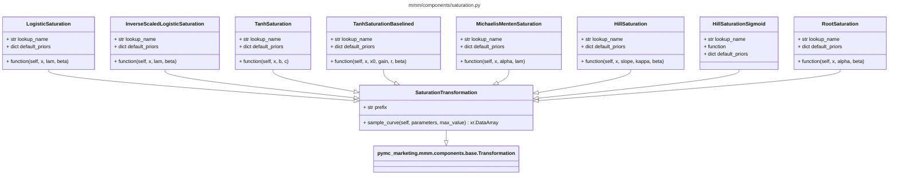

```mermaid
---
title: mmm/components/saturation.py
---
classDiagram
    class SaturationTransformation {
        + str prefix
        + sample_curve(self, parameters, max_value) xr.DataArray
    }

    class LogisticSaturation {
        + str lookup_name
        + function(self, x, lam, beta)
        + dict default_priors
    }

    class InverseScaledLogisticSaturation {
        + str lookup_name
        + function(self, x, lam, beta)
        + dict default_priors
    }

    class TanhSaturation {
        + str lookup_name
        + function(self, x, b, c)
        + dict default_priors
    }

    class TanhSaturationBaselined {
        + str lookup_name
        + function(self, x, x0, gain, r, beta)
        + dict default_priors
    }

    class MichaelisMentenSaturation {
        + str lookup_name
        + function(self, x, alpha, lam)
        + dict default_priors
    }

    class HillSaturation {
        + str lookup_name
        + function(self, x, slope, kappa, beta)
        + dict default_priors
    }

    class HillSaturationSigmoid {
        + str lookup_name
        + function
        + dict default_priors
    }

    class RootSaturation {
        + str lookup_name
        + function(self, x, alpha, beta)
        + dict default_priors
    }

    SaturationTransformation --|> `pymc_marketing.mmm.components.base.Transformation`

    LogisticSaturation --|> SaturationTransformation

    InverseScaledLogisticSaturation --|> SaturationTransformation

    TanhSaturation --|> SaturationTransformation

    TanhSaturationBaselined --|> SaturationTransformation

    MichaelisMentenSaturation --|> SaturationTransformation

    HillSaturation --|> SaturationTransformation

    HillSaturationSigmoid --|> SaturationTransformation

    RootSaturation --|> SaturationTransformation
```
