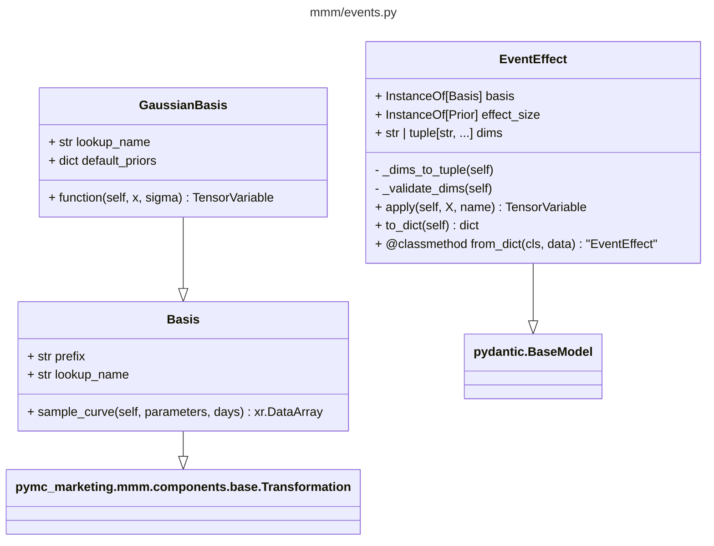

```mermaid
---
title: mmm/events.py
---
classDiagram
    class Basis {
        + str prefix
        + str lookup_name
        + sample_curve(self, parameters, days) xr.DataArray
    }

    class EventEffect {
        + InstanceOf[Basis] basis
        + InstanceOf[Prior] effect_size
        + str | tuple[str, ...] dims
        - _dims_to_tuple(self)
        - _validate_dims(self)
        + apply(self, X, name) TensorVariable
        + to_dict(self) dict
        + @classmethod from_dict(cls, data) "EventEffect"
    }

    class GaussianBasis {
        + str lookup_name
        + function(self, x, sigma) TensorVariable
        + dict default_priors
    }

    Basis --|> `pymc_marketing.mmm.components.base.Transformation`

    EventEffect --|> `pydantic.BaseModel`

    GaussianBasis --|> Basis
```
