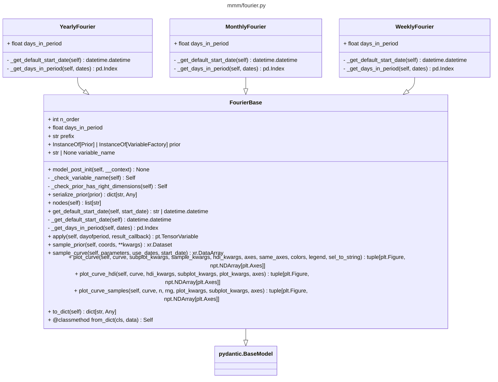

```mermaid
---
title: mmm/fourier.py
---
classDiagram
    class FourierBase {
        + int n_order
        + float days_in_period
        + str prefix
        + InstanceOf[Prior] | InstanceOf[VariableFactory] prior
        + str | None variable_name
        + model_post_init(self, __context) None
        - _check_variable_name(self) Self
        - _check_prior_has_right_dimensions(self) Self
        + serialize_prior(prior) dict[str, Any]
        + nodes(self) list[str]
        + get_default_start_date(self, start_date) str | datetime.datetime
        - _get_default_start_date(self) datetime.datetime
        - _get_days_in_period(self, dates) pd.Index
        + apply(self, dayofperiod, result_callback) pt.TensorVariable
        + sample_prior(self, coords, **kwargs) xr.Dataset
        + sample_curve(self, parameters, use_dates, start_date) xr.DataArray
        + plot_curve(self, curve, subplot_kwargs, sample_kwargs, hdi_kwargs, axes, same_axes, colors, legend, sel_to_string) tuple[plt.Figure, npt.NDArray[plt.Axes]]
        + plot_curve_hdi(self, curve, hdi_kwargs, subplot_kwargs, plot_kwargs, axes) tuple[plt.Figure, npt.NDArray[plt.Axes]]
        + plot_curve_samples(self, curve, n, rng, plot_kwargs, subplot_kwargs, axes) tuple[plt.Figure, npt.NDArray[plt.Axes]]
        + to_dict(self) dict[str, Any]
        + @classmethod from_dict(cls, data) Self
    }

    class YearlyFourier {
        + float days_in_period
        - _get_default_start_date(self) datetime.datetime
        - _get_days_in_period(self, dates) pd.Index
    }

    class MonthlyFourier {
        + float days_in_period
        - _get_default_start_date(self) datetime.datetime
        - _get_days_in_period(self, dates) pd.Index
    }

    class WeeklyFourier {
        + float days_in_period
        - _get_default_start_date(self) datetime.datetime
        - _get_days_in_period(self, dates) pd.Index
    }

    FourierBase --|> `pydantic.BaseModel`

    YearlyFourier --|> FourierBase

    MonthlyFourier --|> FourierBase

    WeeklyFourier --|> FourierBase
```
