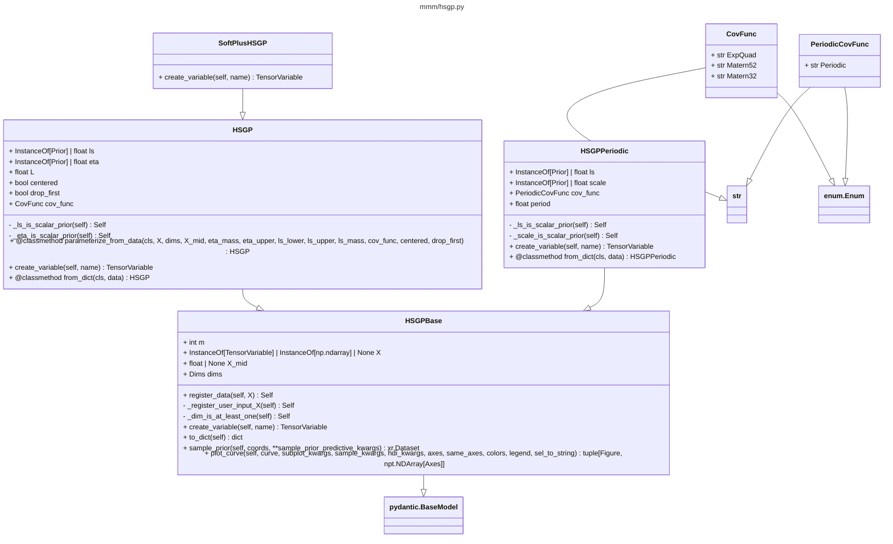

```mermaid
---
title: mmm/hsgp.py
---
classDiagram
    class CovFunc {
        + str ExpQuad
        + str Matern52
        + str Matern32
    }

    class HSGPBase {
        + int m
        + InstanceOf[TensorVariable] | InstanceOf[np.ndarray] | None X
        + float | None X_mid
        + Dims dims
        + register_data(self, X) Self
        - _register_user_input_X(self) Self
        - _dim_is_at_least_one(self) Self
        + create_variable(self, name) TensorVariable
        + to_dict(self) dict
        + sample_prior(self, coords, **sample_prior_predictive_kwargs) xr.Dataset
        + plot_curve(self, curve, subplot_kwargs, sample_kwargs, hdi_kwargs, axes, same_axes, colors, legend, sel_to_string) tuple[Figure, npt.NDArray[Axes]]
    }

    class HSGP {
        + InstanceOf[Prior] | float ls
        + InstanceOf[Prior] | float eta
        + float L
        + bool centered
        + bool drop_first
        + CovFunc cov_func
        - _ls_is_scalar_prior(self) Self
        - _eta_is_scalar_prior(self) Self
        + @classmethod parameterize_from_data(cls, X, dims, X_mid, eta_mass, eta_upper, ls_lower, ls_upper, ls_mass, cov_func, centered, drop_first) HSGP
        + create_variable(self, name) TensorVariable
        + @classmethod from_dict(cls, data) HSGP
    }

    class PeriodicCovFunc {
        + str Periodic
    }

    class HSGPPeriodic {
        + InstanceOf[Prior] | float ls
        + InstanceOf[Prior] | float scale
        + PeriodicCovFunc cov_func
        + float period
        - _ls_is_scalar_prior(self) Self
        - _scale_is_scalar_prior(self) Self
        + create_variable(self, name) TensorVariable
        + @classmethod from_dict(cls, data) HSGPPeriodic
    }

    class SoftPlusHSGP {
        + create_variable(self, name) TensorVariable
    }

    CovFunc --|> str

    CovFunc --|> `enum.Enum`

    HSGPBase --|> `pydantic.BaseModel`

    HSGP --|> HSGPBase

    PeriodicCovFunc --|> str

    PeriodicCovFunc --|> `enum.Enum`

    HSGPPeriodic --|> HSGPBase

    SoftPlusHSGP --|> HSGP
```
