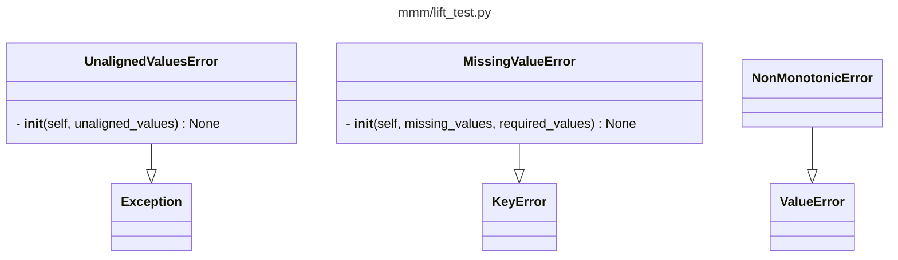

```mermaid
---
title: mmm/lift_test.py
---
classDiagram
    class UnalignedValuesError {
        - __init__(self, unaligned_values) None
    }

    class MissingValueError {
        - __init__(self, missing_values, required_values) None
    }

    class NonMonotonicError

    UnalignedValuesError --|> Exception

    MissingValueError --|> KeyError

    NonMonotonicError --|> ValueError
```
