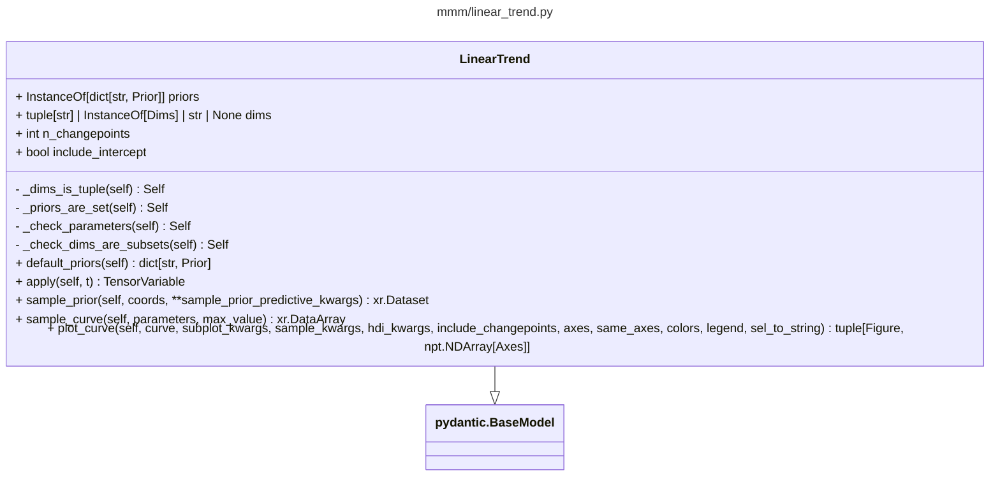

```mermaid
---
title: mmm/linear_trend.py
---
classDiagram
    class LinearTrend {
        + InstanceOf[dict[str, Prior]] priors
        + tuple[str] | InstanceOf[Dims] | str | None dims
        + int n_changepoints
        + bool include_intercept
        - _dims_is_tuple(self) Self
        - _priors_are_set(self) Self
        - _check_parameters(self) Self
        - _check_dims_are_subsets(self) Self
        + default_priors(self) dict[str, Prior]
        + apply(self, t) TensorVariable
        + sample_prior(self, coords, **sample_prior_predictive_kwargs) xr.Dataset
        + sample_curve(self, parameters, max_value) xr.DataArray
        + plot_curve(self, curve, subplot_kwargs, sample_kwargs, hdi_kwargs, include_changepoints, axes, same_axes, colors, legend, sel_to_string) tuple[Figure, npt.NDArray[Axes]]
    }

    LinearTrend --|> `pydantic.BaseModel`
```
