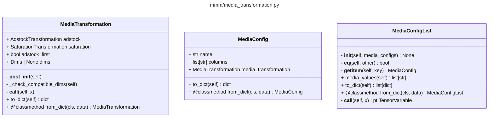

```mermaid
---
title: mmm/media_transformation.py
---
classDiagram
    class MediaTransformation {
        + AdstockTransformation adstock
        + SaturationTransformation saturation
        + bool adstock_first
        + Dims | None dims
        - __post_init__(self)
        - _check_compatible_dims(self)
        - __call__(self, x)
        + to_dict(self) dict
        + @classmethod from_dict(cls, data) MediaTransformation
    }

    class MediaConfig {
        + str name
        + list[str] columns
        + MediaTransformation media_transformation
        + to_dict(self) dict
        + @classmethod from_dict(cls, data) MediaConfig
    }

    class MediaConfigList {
        - __init__(self, media_configs) None
        - __eq__(self, other) bool
        - __getitem__(self, key) MediaConfig
        + media_values(self) list[str]
        + to_dict(self) list[dict]
        + @classmethod from_dict(cls, data) MediaConfigList
        - __call__(self, x) pt.TensorVariable
    }
```
