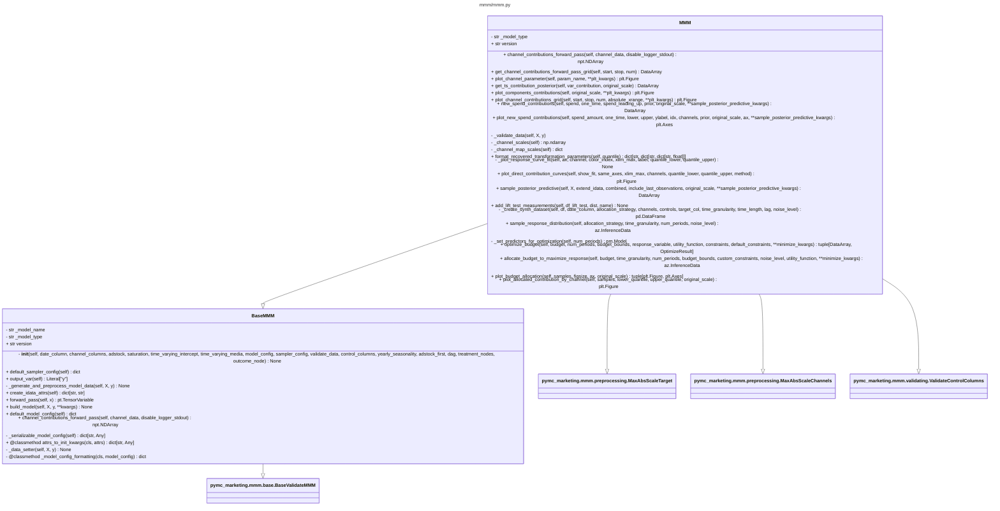

```mermaid
---
title: mmm/mmm.py
---
classDiagram
    class BaseMMM {
        - str _model_name
        - str _model_type
        + str version
        - __init__(self, date_column, channel_columns, adstock, saturation, time_varying_intercept, time_varying_media, model_config, sampler_config, validate_data, control_columns, yearly_seasonality, adstock_first, dag, treatment_nodes, outcome_node) None
        + default_sampler_config(self) dict
        + output_var(self) Literal["y"]
        - _generate_and_preprocess_model_data(self, X, y) None
        + create_idata_attrs(self) dict[str, str]
        + forward_pass(self, x) pt.TensorVariable
        + build_model(self, X, y, **kwargs) None
        + default_model_config(self) dict
        + channel_contributions_forward_pass(self, channel_data, disable_logger_stdout) npt.NDArray
        - _serializable_model_config(self) dict[str, Any]
        + @classmethod attrs_to_init_kwargs(cls, attrs) dict[str, Any]
        - _data_setter(self, X, y) None
        - @classmethod _model_config_formatting(cls, model_config) dict
    }

    class MMM {
        - str _model_type
        + str version
        + channel_contributions_forward_pass(self, channel_data, disable_logger_stdout) npt.NDArray
        + get_channel_contributions_forward_pass_grid(self, start, stop, num) DataArray
        + plot_channel_parameter(self, param_name, **plt_kwargs) plt.Figure
        + get_ts_contribution_posterior(self, var_contribution, original_scale) DataArray
        + plot_components_contributions(self, original_scale, **plt_kwargs) plt.Figure
        + plot_channel_contributions_grid(self, start, stop, num, absolute_xrange, **plt_kwargs) plt.Figure
        + new_spend_contributions(self, spend, one_time, spend_leading_up, prior, original_scale, **sample_posterior_predictive_kwargs) DataArray
        + plot_new_spend_contributions(self, spend_amount, one_time, lower, upper, ylabel, idx, channels, prior, original_scale, ax, **sample_posterior_predictive_kwargs) plt.Axes
        - _validate_data(self, X, y)
        - _channel_scales(self) np.ndarray
        - _channel_map_scales(self) dict
        + format_recovered_transformation_parameters(self, quantile) dict[str, dict[str, dict[str, float]]]
        - _plot_response_curve_fit(self, ax, channel, color_index, xlim_max, label, quantile_lower, quantile_upper) None
        + plot_direct_contribution_curves(self, show_fit, same_axes, xlim_max, channels, quantile_lower, quantile_upper, method) plt.Figure
        + sample_posterior_predictive(self, X, extend_idata, combined, include_last_observations, original_scale, **sample_posterior_predictive_kwargs) DataArray
        + add_lift_test_measurements(self, df_lift_test, dist, name) None
        - _create_synth_dataset(self, df, date_column, allocation_strategy, channels, controls, target_col, time_granularity, time_length, lag, noise_level) pd.DataFrame
        + sample_response_distribution(self, allocation_strategy, time_granularity, num_periods, noise_level) az.InferenceData
        - _set_predictors_for_optimization(self, num_periods) pm.Model
        + optimize_budget(self, budget, num_periods, budget_bounds, response_variable, utility_function, constraints, default_constraints, **minimize_kwargs) tuple[DataArray, OptimizeResult]
        + allocate_budget_to_maximize_response(self, budget, time_granularity, num_periods, budget_bounds, custom_constraints, noise_level, utility_function, **minimize_kwargs) az.InferenceData
        + plot_budget_allocation(self, samples, figsize, ax, original_scale) tuple[plt.Figure, plt.Axes]
        + plot_allocated_contribution_by_channel(self, samples, lower_quantile, upper_quantile, original_scale) plt.Figure
    }

    BaseMMM --|> `pymc_marketing.mmm.base.BaseValidateMMM`

    MMM --|> `pymc_marketing.mmm.preprocessing.MaxAbsScaleTarget`

    MMM --|> `pymc_marketing.mmm.preprocessing.MaxAbsScaleChannels`

    MMM --|> `pymc_marketing.mmm.validating.ValidateControlColumns`

    MMM --|> BaseMMM
```
