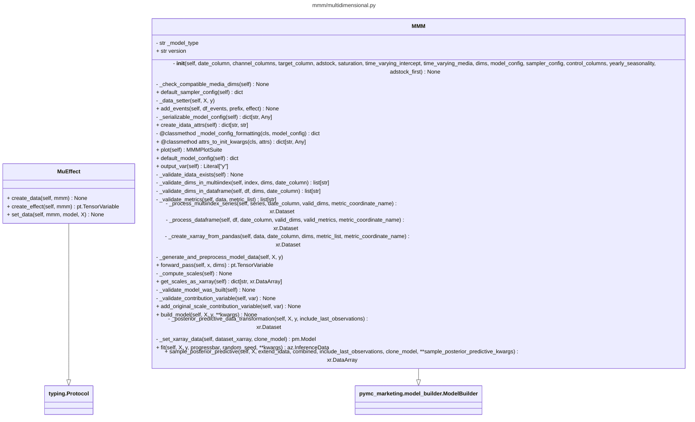

```mermaid
---
title: mmm/multidimensional.py
---
classDiagram
    class MuEffect {
        + create_data(self, mmm) None
        + create_effect(self, mmm) pt.TensorVariable
        + set_data(self, mmm, model, X) None
    }

    class MMM {
        - str _model_type
        + str version
        - __init__(self, date_column, channel_columns, target_column, adstock, saturation, time_varying_intercept, time_varying_media, dims, model_config, sampler_config, control_columns, yearly_seasonality, adstock_first) None
        - _check_compatible_media_dims(self) None
        + default_sampler_config(self) dict
        - _data_setter(self, X, y)
        + add_events(self, df_events, prefix, effect) None
        - _serializable_model_config(self) dict[str, Any]
        + create_idata_attrs(self) dict[str, str]
        - @classmethod _model_config_formatting(cls, model_config) dict
        + @classmethod attrs_to_init_kwargs(cls, attrs) dict[str, Any]
        + plot(self) MMMPlotSuite
        + default_model_config(self) dict
        + output_var(self) Literal["y"]
        - _validate_idata_exists(self) None
        - _validate_dims_in_multiindex(self, index, dims, date_column) list[str]
        - _validate_dims_in_dataframe(self, df, dims, date_column) list[str]
        - _validate_metrics(self, data, metric_list) list[str]
        - _process_multiindex_series(self, series, date_column, valid_dims, metric_coordinate_name) xr.Dataset
        - _process_dataframe(self, df, date_column, valid_dims, valid_metrics, metric_coordinate_name) xr.Dataset
        - _create_xarray_from_pandas(self, data, date_column, dims, metric_list, metric_coordinate_name) xr.Dataset
        - _generate_and_preprocess_model_data(self, X, y)
        + forward_pass(self, x, dims) pt.TensorVariable
        - _compute_scales(self) None
        + get_scales_as_xarray(self) dict[str, xr.DataArray]
        - _validate_model_was_built(self) None
        - _validate_contribution_variable(self, var) None
        + add_original_scale_contribution_variable(self, var) None
        + build_model(self, X, y, **kwargs) None
        - _posterior_predictive_data_transformation(self, X, y, include_last_observations) xr.Dataset
        - _set_xarray_data(self, dataset_xarray, clone_model) pm.Model
        + fit(self, X, y, progressbar, random_seed, **kwargs) az.InferenceData
        + sample_posterior_predictive(self, X, extend_idata, combined, include_last_observations, clone_model, **sample_posterior_predictive_kwargs) xr.DataArray
    }

    MuEffect --|> `typing.Protocol`

    MMM --|> `pymc_marketing.model_builder.ModelBuilder`
```
