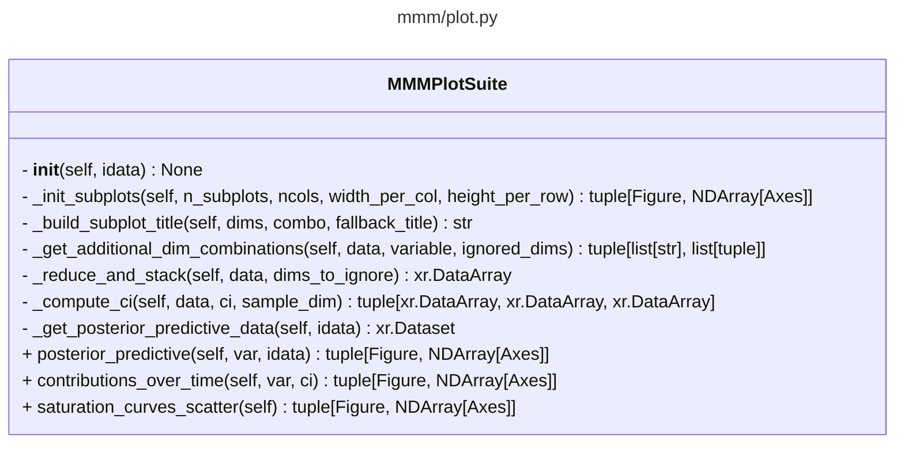

```mermaid
---
title: mmm/plot.py
---
classDiagram
    class MMMPlotSuite {
        - __init__(self, idata) None
        - _init_subplots(self, n_subplots, ncols, width_per_col, height_per_row) tuple[Figure, NDArray[Axes]]
        - _build_subplot_title(self, dims, combo, fallback_title) str
        - _get_additional_dim_combinations(self, data, variable, ignored_dims) tuple[list[str], list[tuple]]
        - _reduce_and_stack(self, data, dims_to_ignore) xr.DataArray
        - _compute_ci(self, data, ci, sample_dim) tuple[xr.DataArray, xr.DataArray, xr.DataArray]
        - _get_posterior_predictive_data(self, idata) xr.Dataset
        + posterior_predictive(self, var, idata) tuple[Figure, NDArray[Axes]]
        + contributions_over_time(self, var, ci) tuple[Figure, NDArray[Axes]]
        + saturation_curves_scatter(self) tuple[Figure, NDArray[Axes]]
    }
```
