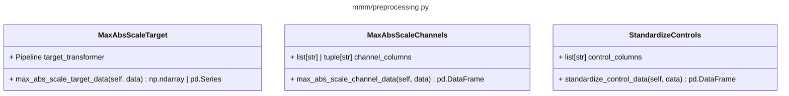

```mermaid
---
title: mmm/preprocessing.py
---
classDiagram
    class MaxAbsScaleTarget {
        + Pipeline target_transformer
        + max_abs_scale_target_data(self, data) np.ndarray | pd.Series
    }

    class MaxAbsScaleChannels {
        + list[str] | tuple[str] channel_columns
        + max_abs_scale_channel_data(self, data) pd.DataFrame
    }

    class StandardizeControls {
        + list[str] control_columns
        + standardize_control_data(self, data) pd.DataFrame
    }
```
