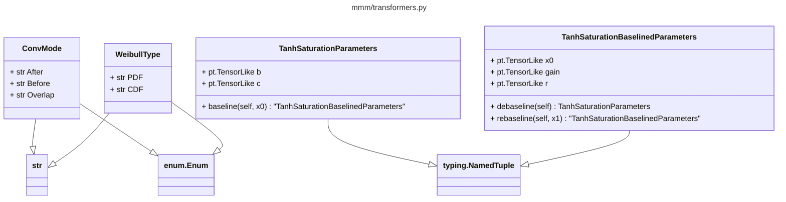

```mermaid
---
title: mmm/transformers.py
---
classDiagram
    class ConvMode {
        + str After
        + str Before
        + str Overlap
    }

    class WeibullType {
        + str PDF
        + str CDF
    }

    class TanhSaturationParameters {
        + pt.TensorLike b
        + pt.TensorLike c
        + baseline(self, x0) "TanhSaturationBaselinedParameters"
    }

    class TanhSaturationBaselinedParameters {
        + pt.TensorLike x0
        + pt.TensorLike gain
        + pt.TensorLike r
        + debaseline(self) TanhSaturationParameters
        + rebaseline(self, x1) "TanhSaturationBaselinedParameters"
    }

    ConvMode --|> str

    ConvMode --|> `enum.Enum`

    WeibullType --|> str

    WeibullType --|> `enum.Enum`

    TanhSaturationParameters --|> `typing.NamedTuple`

    TanhSaturationBaselinedParameters --|> `typing.NamedTuple`
```
