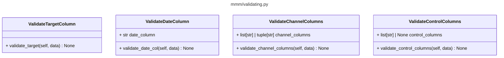

```mermaid
---
title: mmm/validating.py
---
classDiagram
    class ValidateTargetColumn {
        + validate_target(self, data) None
    }

    class ValidateDateColumn {
        + str date_column
        + validate_date_col(self, data) None
    }

    class ValidateChannelColumns {
        + list[str] | tuple[str] channel_columns
        + validate_channel_columns(self, data) None
    }

    class ValidateControlColumns {
        + list[str] | None control_columns
        + validate_control_columns(self, data) None
    }
```
