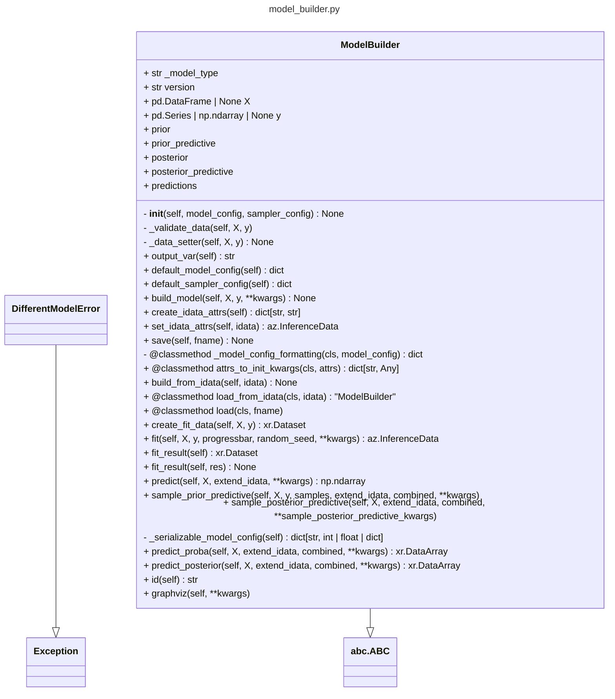

```mermaid
---
title: model_builder.py
---
classDiagram
    class DifferentModelError

    class ModelBuilder {
        + str _model_type
        + str version
        + pd.DataFrame | None X
        + pd.Series | np.ndarray | None y
        - __init__(self, model_config, sampler_config) None
        - _validate_data(self, X, y)
        - _data_setter(self, X, y) None
        + output_var(self) str
        + default_model_config(self) dict
        + default_sampler_config(self) dict
        + build_model(self, X, y, **kwargs) None
        + create_idata_attrs(self) dict[str, str]
        + set_idata_attrs(self, idata) az.InferenceData
        + save(self, fname) None
        - @classmethod _model_config_formatting(cls, model_config) dict
        + @classmethod attrs_to_init_kwargs(cls, attrs) dict[str, Any]
        + build_from_idata(self, idata) None
        + @classmethod load_from_idata(cls, idata) "ModelBuilder"
        + @classmethod load(cls, fname)
        + create_fit_data(self, X, y) xr.Dataset
        + fit(self, X, y, progressbar, random_seed, **kwargs) az.InferenceData
        + fit_result(self) xr.Dataset
        + fit_result(self, res) None
        + predict(self, X, extend_idata, **kwargs) np.ndarray
        + sample_prior_predictive(self, X, y, samples, extend_idata, combined, **kwargs)
        + sample_posterior_predictive(self, X, extend_idata, combined, **sample_posterior_predictive_kwargs)
        - _serializable_model_config(self) dict[str, int | float | dict]
        + predict_proba(self, X, extend_idata, combined, **kwargs) xr.DataArray
        + predict_posterior(self, X, extend_idata, combined, **kwargs) xr.DataArray
        + id(self) str
        + graphviz(self, **kwargs)
        + prior
        + prior_predictive
        + posterior
        + posterior_predictive
        + predictions
    }

    DifferentModelError --|> Exception

    ModelBuilder --|> `abc.ABC`
```
