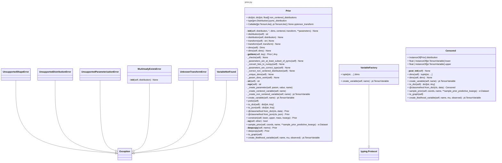

```mermaid
---
title: prior.py
---
classDiagram
    class UnsupportedShapeError

    class UnsupportedDistributionError

    class UnsupportedParameterizationError

    class MuAlreadyExistsError {
        - __init__(self, distribution) None
    }

    class UnknownTransformError

    class VariableFactory {
        + tuple[str, ...] dims
        + create_variable(self, name) pt.TensorVariable
    }

    class Prior {
        + dict[str, dict[str, float]] non_centered_distributions
        + type[pm.Distribution] pymc_distribution
        + Callable[[pt.TensorLike], pt.TensorLike] | None pytensor_transform
        - __init__(self, distribution, *, dims, centered, transform, **parameters) None
        + distribution(self) str
        + distribution(self, distribution) None
        + transform(self) str | None
        + transform(self, transform) None
        + dims(self) Dims
        + dims(self, dims) None
        - __getitem__(self, key) Prior | Any
        - _checks(self) None
        - _parameters_are_at_least_subset_of_pymc(self) None
        - _convert_lists_to_numpy(self) None
        - _parameters_are_correct_type(self) None
        - _correct_non_centered_distribution(self) None
        - _unique_dims(self) None
        - _param_dims_work(self) None
        - __str__(self) str
        - __repr__(self) str
        - _create_parameter(self, param, value, name)
        - _create_centered_variable(self, name)
        - _create_non_centered_variable(self, name) pt.TensorVariable
        + create_variable(self, name) pt.TensorVariable
        + preliz(self)
        + to_dict(self) dict[str, Any]
        + to_json(self) dict[str, Any]
        + @classmethod from_dict(cls, data) Prior
        + @classmethod from_json(cls, json) Prior
        + constrain(self, lower, upper, mass, kwargs) Prior
        - __eq__(self, other) bool
        + sample_prior(self, coords, name, **sample_prior_predictive_kwargs) xr.Dataset
        - __deepcopy__(self, memo) Prior
        + deepcopy(self) Prior
        + to_graph(self)
        + create_likelihood_variable(self, name, mu, observed) pt.TensorVariable
    }

    class VariableNotFound

    class Censored {
        + InstanceOf[Prior] distribution
        + float | InstanceOf[pt.TensorVariable] lower
        + float | InstanceOf[pt.TensorVariable] upper
        - __post_init__(self) None
        + dims(self) tuple[str, ...]
        + dims(self, dims) None
        + create_variable(self, name) pt.TensorVariable
        + to_dict(self) dict[str, Any]
        + @classmethod from_dict(cls, data) Censored
        + sample_prior(self, coords, name, **sample_prior_predictive_kwargs) xr.Dataset
        + to_graph(self)
        + create_likelihood_variable(self, name, mu, observed) pt.TensorVariable
    }

    UnsupportedShapeError --|> Exception

    UnsupportedDistributionError --|> Exception

    UnsupportedParameterizationError --|> Exception

    MuAlreadyExistsError --|> Exception

    UnknownTransformError --|> Exception

    VariableFactory --|> `typing.Protocol`

    VariableNotFound --|> Exception
```
